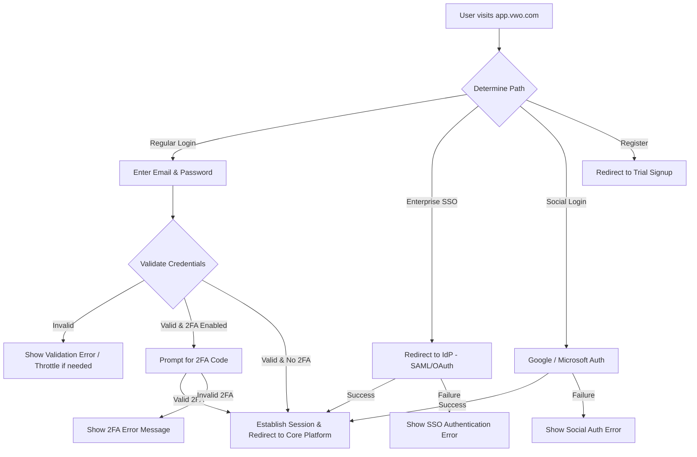

# VWO Login Dashboard - QA Test Plan

## 1. Executive Summary

This document establishes the comprehensive QA Test Plan for the new **VWO Login Dashboard** hosted at [app.vwo.com](https://app.vwo.com). VWO is a market-leading digital experience optimization platform utilized by over 4,000 global brands for core activities like A/B testing, CRO, and analytics. As the gateway to the entire VWO suite, the login dashboard is a mission-critical subsystem. 

The primary objective of this testing strategy is to guarantee a secure, high-performance, accessible, and frictionless authentication experience. It defines the scope, methodologies, testing types, automation strategy, and environment requirements necessary to execute a production-grade release.

---

## 2. Scope

### In Scope
The QA strategy covers the end-to-end authentication flow and user interfaces of the login portal:
* **Core Authentication:** Validation of email and password credentials, session management, and persistent login sessions via the "Remember Me" checkbox.
* **Security Subsystems:** Optional Multi-Factor Authentication (2FA), Enterprise Single Sign-On (SSO) integrations (SAML, OAuth), brute force rate limiting/throttling, data encryption (in-transit and at-rest), and compliance standards verification (GDPR/CCPA/OWASP).
* **User Input Validation:** Real-time form field validation, visual password strength indicators, and error message rendering.
* **Password Management:** Forgot Password recovery workflows, secure token generation, and complexity rules enforcement.
* **User Experience & Themes:** Responsive UI behavior across mobile, tablet, and desktop viewports; Light and Dark mode theme support; autofocus and hover micro-animations.
* **Accessibility (a11y):** Screen reader support (ARIA), keyboard-only navigation, and color contrast compliance (WCAG 2.1 AA).
* **Integrations:** Smooth transition/session handoff to the core VWO dashboard, analytics platform tracking (success/failure events), and customer support assistance widget entry points.
* **Performance & Load:** Sub-2-second page loads, CDN integration, concurrency handling (thousands of simultaneous logins), and high availability (99.9% uptime).

### Out of Scope
* Testing of deep features within the main VWO core platform post-login (e.g., starting an A/B test or viewing heatmaps).
* Internal configurations of third-party Identity Providers (IdPs) like Okta or Azure AD (testing is confined to the standard SAML/OAuth contract and handshake).
* Delivery reliability of third-party SMS gateways (if SMS-based 2FA is used; QA will focus on VWO's API sending triggers and error handling).
* Non-login-related client account onboarding paths (e.g., setting up tracking snippets on external websites).

---

## 3. Feature Overview

The VWO Login Dashboard is the starting point for all VWO platform operations. Below is a breakdown of the primary components and user flows:



### Key Features
1. **Unified Auth Page:** Responsive web form offering standard login, trial registration redirect, and SSO entry point.
2. **Dynamic UI Customization:** Dark and Light mode theme options triggered by system settings or user preference, with product announcement banners.
3. **MFA Interface:** Secondary verification code input screen that activates dynamically for accounts with 2FA enabled.
4. **Forgot Password flow:** Standalone form requesting email address, triggering a background reset email containing a time-limited token.

---

## 4. Requirements Summary

Derived directly from the PRD, the core requirements mapped to verification vectors:

| Req ID | Component | Requirement Description | Verification Method |
| :--- | :--- | :--- | :--- |
| **AUTH-01** | Core Auth | Secure authentication via email & password. | Functional Testing |
| **AUTH-02** | Session | Configurable session timeout and secure token generation. | API & Security Testing |
| **AUTH-03** | MFA | Support for optional 2FA verification. | Functional & Integration |
| **AUTH-04** | SSO | SAML and OAuth integration for enterprise customers. | Integration Testing |
| **VAL-01** | Validation | Real-time input validation on blur with specific error states. | UI & Functional Testing |
| **VAL-02** | Password | Enforced complexity rules and visual strength indicators. | UI & Functional Testing |
| **PWD-01** | Password Mgmt | Forgot password flow with secure token-based reset link. | Functional & Security |
| **UX-01** | Layout | Responsive mobile-optimized page with touch controls. | UI & Cross-Browser |
| **UX-02** | Accessibility | Keyboard navigation, contrast compliance, and ARIA labels. | Accessibility Audit |
| **UX-03** | Styling | VWO design system alignment, Light/Dark mode themes. | Visual Regression |
| **SEC-01** | Encryption | SSL/TLS HTTPS enforcement and password hashing (bcrypt/argon2). | Security Testing |
| **SEC-02** | Rate Limiting | IP & account-based rate limiting to prevent brute force. | Security & Load Testing |
| **PERF-01** | Load Time | Page load speed < 2 seconds globally via CDN optimization. | Performance Testing |
| **PERF-02** | Scalability | 99.9% availability, supporting thousands of concurrent users. | Load Testing |
| **INT-01** | Handoff | Redirection to main dashboard preserving session state. | Integration & E2E |
| **INT-02** | Analytics | Track login success/failure events. | Analytics Verification |

---

## 5. Assumptions

### Facts (Explicitly in PRD)
1. Page must load in under 2 seconds on standard connections.
2. Form fields require real-time validation on blur.
3. Enterprise SSO requires support for SAML and OAuth.
4. User experience requires accessibility compliance (WCAG 2.1 AA, screen readers, contrast).
5. GDPR and CCPA compliance must be adhered to.
6. Rate limiting is mandatory to protect against brute force attacks.

### Project Assumptions (To be verified)
1. **Session Timeout Defaults:** Assumed default idle timeout is 30 minutes, and "Remember Me" persistent session duration is 14 days.
2. **2FA Channels:** Assumed 2FA is implemented via standard TOTP (Google Authenticator) and email codes. SMS is assumed out-of-scope for the initial release phase.
3. **Password Rules:** Assumed minimum password length is 8 characters, containing at least one uppercase letter, one lowercase letter, one number, and one special character.
4. **Analytics Payload:** Assumed analytics events do not capture PII (Personally Identifiable Information) like plaintext passwords or usernames, only anonymized account/user IDs.
5. **Localization:** Assumed the login portal is English-only for Phase 1, with multi-language assets prepared for future localization.

---

## 6. Dependencies

The login platform relies on several internal/external systems:
* **SMTP / Transactional Email Service:** For sending Forgot Password reset links and verification tokens. A delay here breaks password recovery.
* **Identity Providers (IdPs):** Active integrations with client-side IdPs (e.g., Okta, Azure AD, Ping Identity) for SAML/OAuth testing.
* **Third-Party Identity APIs:** Google and Microsoft Social Login APIs.
* **VWO Core Session Service:** The backend session manager that generates and validates session cookies.
* **CDN Provider (e.g., Cloudflare, Akamai):** Global asset delivery caching layer.
* **Analytics Data Warehouse:** The ingestion endpoint for tracking authentication metadata.

---

## 7. Risks and Mitigation Plan

| Risk Description | Impact | Probability | Mitigation Strategy |
| :--- | :--- | :--- | :--- |
| **Brute Force Penetration:** Attackers bypass simple rate limits due to misconfigured IP proxy parsing (e.g., ignoring `X-Forwarded-For`). | High | High | Implement robust IP-based and username-based rate-limiting locks. Validate proxy headers in testing. Request QA security scan for rate-limiting bypasses. |
| **Session Hijacking / CSRF:** Session tokens intercepted due to lack of strict cookie attributes. | High | Medium | Enforce `Secure`, `HttpOnly`, and `SameSite=Lax` attributes on all authentication cookies. Scan cookie behavior during automation. |
| **IdP Integration Failures:** Changes in third-party SSO (Google/Microsoft/Okta APIs) break the login flow. | High | Medium | Build automated integration health-checks that run continuously in staging and post-production to detect API deprecations. |
| **CSS Glitches in Light/Dark Modes:** Switching themes hides text or buttons due to poor contrast. | Medium | High | Automated visual regression tests across multiple viewports for both themes using Percy or Applitools. |
| **Forgot Password Token Leak:** Token exposed in URL logs or remains active indefinitely. | High | Low | Token must be passed securely (POST payload or single-use query parameter) and must expire within 15 minutes. Verify database state post-invalidation. |

---

## 8. Test Strategy

We adopt a **Risk-Based, Automation-First Strategy** to test the VWO Login Dashboard. This approach optimizes coverage across the three planned implementation phases.

```
                   +----------------------------------+
                   |       Phase 1: Core Auth         |
                   | - Functional: Basic Form / Reset |
                   | - Security: SSL & Hashing        |
                   +----------------------------------+
                                    |
                                    v
                   +----------------------------------+
                   |       Phase 2: Enhanced UX       |
                   | - UI: Responsive & Themes        |
                   | - Accessibility: WCAG AA         |
                   +----------------------------------+
                                    |
                                    v
                   +----------------------------------+
                   |    Phase 3: Enterprise & Perf    |
                   | - Integration: SSO & Analytics   |
                   | - Performance: Concurrency & CDN |
                   +----------------------------------+
```

### Automation Focus
* **Unit Testing:** Validate credentials regex, utility functions (e.g., password strength logic), and UI theme components in isolation (Jest/JUnit).
* **API Testing:** Automate verification of auth endpoints, token validation, recovery endpoints, and rate-limiting responses.
* **UI/E2E Testing:** Automated cross-browser scripts testing key paths: successful login, forgot password, error handling, and visual regression (Playwright/Selenium).

---

## 9. Testing Types

### Functional Testing
Verify that all logical capabilities behave according to the business rules.

#### Positive Test Cases
* **FUNC-POS-01:** Log in with valid email and password credentials -> Verify transition to Core Platform.
* **FUNC-POS-02:** Select "Remember Me" checkbox -> Close browser -> Reopen -> Verify bypass of credentials input.
* **FUNC-POS-03:** Forgot Password request with registered email -> Verify receipt of reset email with valid link.
* **FUNC-POS-04:** Use reset link within active window -> Input valid new password -> Verify successful update and login.
* **FUNC-POS-05:** Verify 2FA prompt appears on valid credentials entry for 2FA-enabled account -> input valid code -> Verify access.

#### Negative Test Cases
* **FUNC-NEG-01:** Log in with incorrect password -> Verify clear, generic error message (avoiding security disclosure of user existence).
* **FUNC-NEG-02:** Log in with unregistered email -> Verify same generic error message to prevent account enumeration.
* **FUNC-NEG-03:** Click submit with empty email/password fields -> Verify instant client-side validation errors.
* **FUNC-NEG-04:** Try using expired or modified Forgot Password token -> Verify access denial and display of clear recovery path.
* **FUNC-NEG-05:** Input invalid format email (e.g. `user@com`, `@domain.com`) -> Verify real-time format validation triggers on blur.

#### Boundary & Edge Cases
* **FUNC-EDGE-01:** Copy and paste email address containing leading/trailing spaces -> Verify systems trim whitespaces prior to validation.
* **FUNC-EDGE-02:** Test email and password fields at maximum boundary limits (e.g., 255-character email, 128-character password).
* **FUNC-EDGE-03:** Simulate network drop during credentials submission -> Verify spinner handles state gracefully and does not hang the UI.
* **FUNC-EDGE-04:** Trigger multiple concurrent login requests for the same user account from different devices/browsers -> Verify concurrent session rules.

---

### Integration Testing
Ensure seamless handoffs between VWO and external platforms.

* **INT-SSO-01:** Initiate SAML SSO authentication from VWO login -> Redirect to Okta -> Authenticate -> Verify callback redirects user successfully to Core Platform with correct session payload.
* **INT-SSO-02:** Authenticate via OAuth enterprise flow -> Verify token expiration handles automatic re-auth prompts gracefully.
* **INT-SSO-03:** Social Login - Google/Microsoft: Click icon -> complete authentication on provider page -> verify account correlation and login.
* **INT-CORE-01:** Verify correct redirection URL routing post-login (e.g., redirecting to the specific sub-module/campaign the user was viewing prior to session expiry).
* **INT-ANALYTICS-01:** Trigger successful login, failed login, and forgot password requests -> Inspect network payload to confirm tracking events (e.g., Segment, Mixpanel, or custom VWO collector) fire with correct event properties.
* **INT-SUPPORT-01:** Click Help / Support icon -> Verify integration widget (e.g., Intercom/Zendesk) initializes correctly and pre-fills email where available.

---

### UI Testing
Confirm visual perfection, responsiveness, and transitions.

* **UI-RESP-01:** Render login dashboard on target resolutions: Desktop (1920x1080), Tablet (768x1024), and Mobile (375x812, 414x896). Verify no element overlaps, text truncation, or horizontal scrolling.
* **UI-THEME-01:** Toggle between Light and Dark modes. Verify background, text, borders, inputs, and announcement banners display correctly with zero color clashing.
* **UI-STATE-01:** Verify input fields highlight on focus and autofocus land on the Email input field upon page mount.
* **UI-LOAD-01:** Trigger Login. Verify high-contrast loading indicator/spinner overlays the form and disables interactive inputs to prevent duplicate submissions.

---

### Accessibility Testing
Adhere strictly to WCAG 2.1 AA guidelines.

* **A11Y-SCREEN-01:** Navigate through the entire page utilizing JAWS, NVDA, and Mac VoiceOver. All forms must declare descriptive names, inputs must associate with `<label>` tags, and error states must speak via `aria-live`.
* **A11Y-KEYBOARD-01:** Navigate using only `Tab` and `Shift+Tab`. Ensure focus order is logical (Email -> Password -> Remember Me -> Login -> Forgot Password -> SSO -> Social -> Signup). Active element must render a distinct focus ring. Use `Space` and `Enter` to activate checkboxes and buttons.
* **A11Y-CONTRAST-01:** Audit all text elements in both Light and Dark mode using visual analyzers. Ensure color contrast ratios satisfy the minimum requirement of **4.5:1** for normal text and **3.0:1** for large text/icons.

---

### Security Testing
Maintain enterprise-grade defenses on authentication vectors.

* **SEC-CRYPTO-01:** Verify all traffic runs exclusively over HTTPS. Attempts to access HTTP must perform a 301 redirect to HTTPS.
* **SEC-COOKIE-01:** Inspect response headers for authentication cookies. Assert presence of `Secure`, `HttpOnly`, and `SameSite=Lax/Strict` properties.
* **SEC-RATE-LIMIT-01 (Brute Force):** Attempt 5 consecutive failed logins from a single IP -> Verify next requests are throttled with a 429 status code. Attempt 5 failed logins for a single account across different IPs -> Verify target account is temporarily locked.
* **SEC-OWASP-01:** Test fields against input attacks: SQL Injection (SQLi), Cross-Site Scripting (XSS), and HTML injection payload testing. Ensure all inputs are sanitized backend-side.

---

### Performance Testing
Deliver speed and responsiveness under concurrent loads.

* **PERF-SPEED-01:** Using tools like Google Lighthouse and WebPageTest, verify First Contentful Paint (FCP) is < 1.0s and Time to Interactive (TTI) is < 2.0s over standard 3G/4G connections.
* **PERF-LOAD-01:** Run load scripts using JMeter/k6 simulating 2,000 concurrent login attempts within a 5-minute ramp-up -> Verify average response time remains < 1.5s, with 0% transaction failure rate.
* **PERF-CDN-01:** Verify CDN header responses (`X-Cache`, `CF-Cache-Status`) confirm static login page assets (JS, CSS, logos) are cached and delivered from edge locations.

---

### Cross-browser Testing
Ensure uniform behavior across key platforms:

| OS | Browser | Version Scope | Priority |
| :--- | :--- | :--- | :--- |
| Windows 11 | Google Chrome | Latest (Auto-update) | High |
| Windows 11 | Microsoft Edge | Latest | High |
| Windows 11 | Mozilla Firefox | Latest | Medium |
| macOS Sequoia | Apple Safari | Latest | High |
| macOS Sequoia | Google Chrome | Latest | High |
| iOS 17/18 | Apple Safari | Latest | High |
| Android 14/15 | Google Chrome | Latest | High |

---

### Exploratory Testing
Uncover unscripted edge-case scenarios:

* **Charter 1:** Interrupt the login flow (e.g. trigger page reload, click "Back" button, change network latency midway) to confirm session states do not lock or corrupt local browser state.
* **Charter 2:** Test browser tab behaviors—log in on Tab 1, log out on Tab 2, and verify state detection on Tab 1 upon next action.
* **Charter 3:** Auto-fill behavior audits: test how popular managers (1Password, LastPass, Chrome Auto-fill) interact with validation animations and field masks.

---

### Regression Testing
Prevent regressions in critical user entry paths.

* **Smoke Suite:** Run a subset of 15 automated critical tests (standard login, forgot password email trigger, basic SSO redirect) on every staging deployment and CI pipeline.
* **Full Regression:** Execute the full automated test suite (including cross-browser configurations) nightly and before major releases.

---

## 10. Test Environment Requirements

To perform complete functional, security, and performance testing, the environment must replicate production configurations:

1. **Staging Environment:** Dedicated testing environment mapped to `staging-app.vwo.com` configured with same CPU, memory, and database configurations as production (auto-scaling enabled).
2. **SSO Identity Providers (Sandboxes):**
   * **Okta Developer Tenant:** Configured with SAML integrations to test VWO enterprise SSO handshakes.
   * **Azure Active Directory Sandbox:** Configured for OAuth 2.0 Enterprise connections.
3. **Sandbox Social Identity Accounts:**
   * Safe, non-production test Google and Microsoft account credentials dedicated for automated social login.
4. **Mock Mail Server / Inbox API:**
   * Integration with services like **Mailtrap** or **Mailhog** in staging environments. Allows programmatic extraction of reset password tokens from emails during automated tests.

---

## 11. Test Data Requirements

A matrix of pre-staged user accounts must be maintained across environments:

| User Identifier / Role | Configuration Status | Test Purpose |
| :--- | :--- | :--- |
| `std_user_valid@vwo-test.com` | Standard login active; no MFA | Positive standard authentication checks |
| `std_user_mfa@vwo-test.com` | standard login active; 2FA enabled | Positive/negative multi-factor flow |
| `ent_sso_saml@vwo-test.com` | Linked to Okta Sandbox | SAML SSO verification |
| `ent_sso_oauth@vwo-test.com`| Linked to Azure AD Sandbox | OAuth SSO verification |
| `social_google@vwo-test.com` | Linked to Test Google Account | Social Google Auth verification |
| `locked_user@vwo-test.com` | Account locked status | Locked account state UI validation |
| `expired_pwd@vwo-test.com` | Password expired flag active | Password expiration recovery UI flow |

---

## 12. Test Coverage Matrix

Tracing requirements to test execution scopes:

| Requirement ID | Requirement Summary | Positive Test IDs | Negative / Edge Test IDs | Verification Stage |
| :--- | :--- | :--- | :--- | :--- |
| **AUTH-01** | Primary Authentication | FUNC-POS-01 | FUNC-NEG-01, FUNC-NEG-02 | Phase 1 |
| **AUTH-02** | Session Timeout | FUNC-POS-02 | FUNC-EDGE-04, SEC-COOKIE-01 | Phase 1 |
| **AUTH-03** | 2FA / MFA Support | FUNC-POS-05 | FUNC-NEG-05 | Phase 2 |
| **AUTH-04** | SAML/OAuth SSO | INT-SSO-01, INT-SSO-02 | INT-SSO-03 | Phase 3 |
| **VAL-01** | Input Validation | FUNC-POS-01 | FUNC-NEG-03, FUNC-EDGE-01 | Phase 1 |
| **VAL-02** | Password Strength | FUNC-POS-04 | FUNC-NEG-04, FUNC-EDGE-02 | Phase 1 |
| **UX-01** | Responsive Layout | UI-RESP-01 | UI-LOAD-01 | Phase 2 |
| **UX-02** | WCAG 2.1 AA | A11Y-SCREEN-01 | A11Y-KEYBOARD-01, A11Y-CONTRAST-01 | Phase 2 |
| **UX-03** | Light/Dark Theme | UI-THEME-01 | UI-STATE-01 | Phase 2 |
| **SEC-02** | Rate Limiting | SEC-RATE-LIMIT-01 | SEC-RATE-LIMIT-01 | Phase 3 |
| **PERF-01**| Page Load Speed | PERF-SPEED-01 | PERF-CDN-01 | Phase 3 |
| **PERF-02**| Concurrent Scale | PERF-LOAD-01 | PERF-LOAD-01 | Phase 3 |
| **INT-01** | Dashboard Handoff | INT-CORE-01 | FUNC-EDGE-03 | Phase 1 |
| **INT-02** | Analytics Tracking | INT-ANALYTICS-01 | INT-ANALYTICS-01 | Phase 3 |

---

## 13. Automation Strategy

Automation is critical to ensure high release velocity without regression:

1. **API Testing:**
   * **Framework:** RestAssured (Java) or Postman/Newman.
   * **Scope:** Test backend endpoints `/api/auth/login`, `/api/auth/reset-password`, `/api/auth/sso` independently of UI.
2. **UI End-to-End Testing:**
   * **Framework:** Playwright (preferred for fast, headless cross-browser verification) or Selenium Java (integrating with the existing Maven project in the workspace: `Porject_02_Ricepot_selenium`).
   * **Scope:** Core login flows, 2FA prompt, forgot password email token parsing.
3. **Visual Regression:**
   * **Tool:** Applitools Eyes or Playwright Visual Comparisons.
   * **Scope:** Light/Dark theme rendering across viewport widths to ensure zero component overlapping or contrast drops.
4. **CI/CD Integration:**
   * Tests must trigger automatically on Pull Requests to `main`/`release` branches.
   * Execution block: PR merge requires a successful API and Smoke automation run.

---

## 14. Entry Criteria

Testing will commence only when the following gates are cleared:
1. **Design Sign-off:** Figma UI/UX designs for both Light and Dark modes are finalized and approved by Product/UX teams.
2. **Environment Availability:** The Staging/QA test environment is fully deployed and stable.
3. **Feature Build Deployment:** Build packages matching the release phase requirements are successfully deployed.
4. **Test Data Readiness:** Test user database is initialized, and sandbox SSO connections are operational.
5. **Test Plan Approval:** This QA Test Plan is reviewed and approved by Engineering, PM, and QA Stakeholders.

---

## 15. Exit Criteria

The login dashboard will be declared ready for production release when:
1. **Test Coverage Met:** 100% of defined high-priority and medium-priority test cases are executed.
2. **Pass Rate Goal:** Minimum overall test pass rate is **98%** (all failed cases must be verified non-critical).
3. **Defect Thresholds:**
   * Zero open Blocker (P0) or Critical (P1) defects.
   * Zero open Major (P2) defects without documented, approved walk-arounds or deferral agreements.
4. **Performance Gate:** Login page loads in under 2.0s in tests, and concurrent load tests sustain target concurrency with zero server crash.
5. **Accessibility Gate:** Accessibility audit passes with 100% keyboard navigation success and zero contrast failures.
6. **Automation Coverage:** Core validation, standard login, and forgot password paths are covered in the regression suite.

---

## 16. Defect Management Strategy

### Defect Lifecycle
All bugs discovered during testing are tracked through standard states: 
`New` -> `Triaged` -> `In Progress` -> `Resolved (Ready for QA)` -> `Retested` -> `Closed` (or `Reopened`).

### Severity Classifications

* **Blocker (S1):** Complete system unavailability. Login dashboard fails to load, database auth is down, or critical security vulnerabilities (e.g., SQLi) exist.
* **Critical (S2):** Core functional flow broken. Users cannot log in with valid credentials, password resets fail to send emails, or SSO redirects loop indefinitely.
* **Major (S3):** Feature degradation. Input validation fails on mobile, accessibility keyboard loops occur, or load time exceeds 5 seconds.
* **Minor (S4):** Visual or minor layout issue. Incorrect padding, minor console warnings, or alignment problems that do not affect the login process.

---

## 17. Release Readiness Checklist

Before a production deployment is authorized, the release lead must check off:

- [ ] **Functional Smoke Pass:** 100% success on core login path.
- [ ] **Cross-browser Sign-off:** Verification completed on Safari, Chrome, Edge, and mobile viewports.
- [ ] **Security Scan:** No high-risk vulnerability alerts from OWASP/dependency checks.
- [ ] **Performance Audit:** Google Lighthouse score > 90 for performance on desktop/mobile.
- [ ] **Third-Party Handshakes:** SSO Okta and Google/Microsoft login configurations verified.
- [ ] **Rollback Plan Active:** Verified roll-back scripts and database backup triggers are in place.
- [ ] **Monitoring Set up:** Production alerts (Datadog/New Relic/LogRocket) active for authentication endpoints.

---

## 18. Metrics and Reporting

During test cycles, QA will publish daily dashboards highlighting:
* **Test Execution Velocity:** Number of cases executed vs. planned.
* **Defect Density:** Active bug counts categorized by Severity (S1-S4) and Component.
* **Defect Slip Rate:** Metrics on any defect discovered post-deployment (post-release monitoring).
* **Automation Run Reports:** Traceability reports of CI execution success rates.
* **Core KPIs Tracking:**
  * Average page load speed metrics.
  * 2FA/SSO processing duration.

---

## 19. Requirement Gaps / Clarifications Needed

During PRD analysis, the QA team identified several gaps that require clarification from Product Managers and Developers prior to script finalization:

> [!WARNING]
> The following parameters are currently undefined in the PRD and pose testing risks.

1. **Brute Force Lockout Mechanics:**
   * *Gap:* PRD states "Rate Limiting: Protection against brute force attacks through request throttling."
   * *Clarification Needed:* What is the exact failure count threshold? Is lockout IP-based, account-based, or both? What is the lockout duration (e.g., 15 minutes), and does it require CAPTCHA or email authorization to unlock?
2. **Optional MFA Type Definition:**
   * *Gap:* PRD states "Optional 2FA support for enhanced security."
   * *Clarification Needed:* What types of 2FA are supported (Google Authenticator TOTP, Email OTP, or SMS)? If SMS/Email are used, what are the resend timeouts and validity periods of the codes? How do users recover accounts if they lose their 2FA device?
3. **Session Expiry Duration:**
   * *Gap:* PRD states "Secure session handling with configurable timeout periods."
   * *Clarification Needed:* What are the default idle timeouts for standard users? If "Remember Me" is checked, what is the maximum cookie persistence window (e.g., 30 days)? Does this change for enterprise SSO users?
4. **Social Login Behavior for New Users:**
   * *Gap:* PRD mentions "Social Login: Optional integration with Google, Microsoft."
   * *Clarification Needed:* If a user attempts to log in via Google with an email not pre-registered in VWO, does the system automatically create a new trial account, or does it return an error?
5. **Analytics Privacy Safeguards:**
   * *Gap:* PRD mentions "Analytics Integration: Login success/failure tracking."
   * *Clarification Needed:* Which analytics tags/events are fired, and how is it ensured that no password strings or emails are accidentally captured in telemetry payloads?

---

## 20. Recommendations

To elevate the login dashboard's quality, security, and operational monitoring, the QA team recommends implementing the following best practices:

* **Integrate CAPTCHA Challenges:** Trigger a Google reCAPTCHA v3 challenge when rate limit thresholds are crossed (e.g., after 3 failed attempts) to prevent scripted credential stuffing while minimizing friction for real users.
* **Adopt Synthetic Monitoring:** Set up synthetic E2E tests running every 5 minutes in production (using tools like Datadog Synthetics or Pingdom) that simulate log-ins using a test account. This alerts the team to authentication API or SSO failures immediately, before real clients notice.
* **Strict CSS Auto-Linting:** Since Light and Dark themes are supported, integrate CSS validation in pre-commit hooks to prevent low-contrast colors or hidden elements from reaching staging.
* **Implement Progressive Profiling:** For social signups, capture minimal info initially, then progressively request organization details upon redirection to reduce onboarding drop-off.
